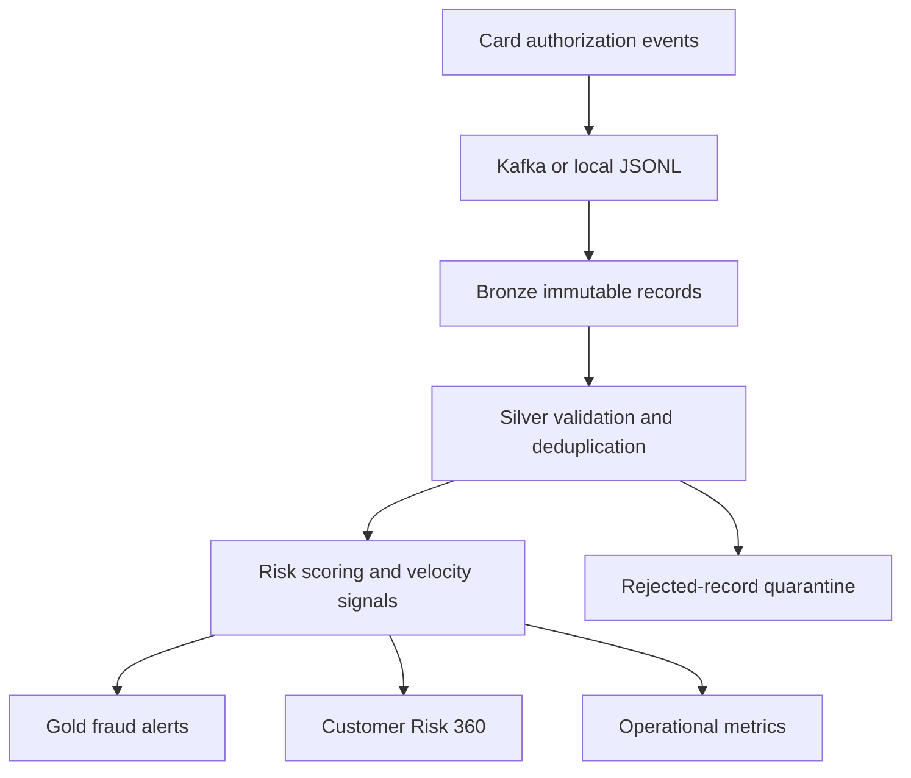

# Real-Time Financial Fraud and Risk Lakehouse

An end-to-end data engineering project for processing card-authorization events, applying data-quality controls, calculating explainable transaction-risk signals, and publishing fraud-review and Customer Risk 360 datasets.

The project is based on the technologies and responsibilities in my JPMorgan Chase data engineering experience: Python, SQL, PySpark, Kafka, Airflow, Databricks, Delta Lake, Snowflake, cloud lakehouse architecture, Unity Catalog, RBAC, Terraform, Docker, Kubernetes, CI/CD, observability, and regulated-data controls. All included data is synthetic and contains no customer or proprietary bank information.

## Business problem

Card authorizations arrive continuously and may be duplicated, delayed, malformed, or delivered out of order. Fraud and risk teams need trusted transaction data within minutes, but downstream data cannot be published until identifiers, timestamps, amounts, customer mappings, duplicate handling, and risk rules have been validated.

This project creates one governed processing path from raw financial events to:

- standardized and deduplicated transactions;
- quarantined invalid records with clear reasons;
- explainable fraud and risk alerts;
- customer-level risk summaries;
- hourly operational metrics;
- reproducible quality reports and audit metadata.

## Architecture



The local implementation runs with the Python standard library so an interviewer can reproduce it quickly. The enterprise examples show how the same boundaries map to Kafka, Spark Structured Streaming, Databricks Delta, Airflow, dbt, Snowflake, AWS, Docker and Kubernetes.

## Verified demonstration results

The deterministic default run produces:

| Measure | Result |
| --- | ---: |
| Logical card transactions | 5,000 |
| Physical source rows | 5,105 |
| Canonical Silver transactions | 5,000 |
| Duplicate events removed | 100 |
| Malformed events quarantined | 5 |
| Late events observed | 218 |
| Fraud and risk alerts | 81 |
| High-severity alerts | 75 |
| Medium-severity alerts | 6 |
| Customer Risk 360 records | 500 |
| Overall quality gate | PASS |

These results come from `make demo` with seed `20260917`.

## Quick start

Requirements: Python 3.10 or newer. The local demo has no third-party Python dependencies.

```bash
git clone <your-repository-url>
cd jpmorgan-real-time-fraud-risk-lakehouse
make demo
make test
```

If `make` is unavailable on Windows:

```powershell
$env:PYTHONPATH="src"
python -m risk_lakehouse.generator --output data/raw --customers 500 --accounts 750 --cards 1000 --transactions 5000 --seed 20260917
python -m risk_lakehouse.pipeline --input data/raw --output data/processed --config config/project.json
python -m unittest discover -s tests -v
```

Optional enterprise dependencies can be installed separately when needed:

```bash
pip install -e ".[streaming,spark,warehouse]"
```

## Generated outputs

After `make demo`, inspect:

- `data/processed/bronze/` - immutable copies of the source files;
- `data/processed/silver/transactions.csv` - validated canonical transactions;
- `data/processed/silver/rejected_records.csv` - invalid records and rejection reasons;
- `data/processed/gold/risk_scored_transactions.csv` - transaction scores and explainable reason codes;
- `data/processed/gold/fraud_alerts.csv` - medium- and high-severity review queue;
- `data/processed/gold/customer_risk_360.csv` - customer risk aggregates;
- `data/processed/gold/hourly_risk_metrics.csv` - operational alert and volume trends;
- `data/processed/metrics/quality_report.json` - control rates and PASS/FAIL gate;
- `data/processed/risk_lakehouse.db` - SQLite copy for local SQL exploration.

## Risk signals

The demonstration uses transparent rules rather than a black-box model:

- high-value transaction;
- high-risk merchant category;
- configured demonstration risk country;
- cross-border transaction;
- new device;
- declined authorization;
- high transaction velocity;
- elevated customer risk tier.

The score is capped at 100. Scores from 60 through 79 create medium-severity alerts, while scores of 80 or higher create high-severity alerts. Thresholds are configurable in `config/project.json`.

## Data quality and reliability controls

- required-field validation;
- positive numeric amount validation;
- timezone-aware timestamp parsing;
- reference checks against customer, account and card masters;
- deterministic deduplication using source system plus event ID;
- rejected-record quarantine with source file and line number;
- late-event measurement;
- configurable reject- and duplicate-rate gates;
- deterministic test data and repeatable output counts;
- rerunnable local pipeline with stable canonical results.

## Project structure

| Area | Purpose |
| --- | --- |
| `src/risk_lakehouse` | Generator, quality rules, risk scoring and local pipeline |
| `tests` | Unit and end-to-end idempotency tests |
| `streaming` | Kafka event producer |
| `spark_jobs` | Kafka-to-Delta Structured Streaming reference job |
| `airflow/dags` | Orchestration example |
| `dbt_project` | Snowflake staging, alert mart and tests |
| `sql` | Warehouse DDL, masking policy and analyst queries |
| `terraform/aws` | Encrypted object storage, catalog, logs and least-privilege policy |
| `docker-compose.yml` | Local Redpanda-compatible Kafka environment |
| `k8s` | Scheduled container execution example |
| `.github/workflows` | Automated tests and quality-gate verification |
| `docs` | Architecture, data dictionary, runbook and interview preparation |

## Enterprise deployment path

1. Publish authorization events to Kafka or Kinesis with an idempotent producer.
2. Retain raw payloads and broker metadata in encrypted object storage.
3. Process events with Spark Structured Streaming on Databricks using watermarks, checkpoints and Delta tables.
4. Register governed tables in Unity Catalog and restrict sensitive fields with RBAC and masking.
5. Publish Gold marts to Snowflake for fraud, compliance and analytics consumers.
6. Orchestrate batch dependencies and control checks with Airflow.
7. Deploy infrastructure with Terraform and application workloads with containers and Kubernetes.
8. Monitor throughput, end-to-end latency, Kafka lag, reject rate, duplicate rate, checkpoint health and alert volume.

## Documentation

- [Architecture](docs/ARCHITECTURE.md)
- [Data dictionary](docs/DATA_DICTIONARY.md)
- [Operations runbook](docs/RUNBOOK.md)
- [Interview guide](docs/INTERVIEW_GUIDE.md)
- [Verified demo results](docs/DEMO_RESULTS.md)

## License

MIT License. See [LICENSE](LICENSE).
