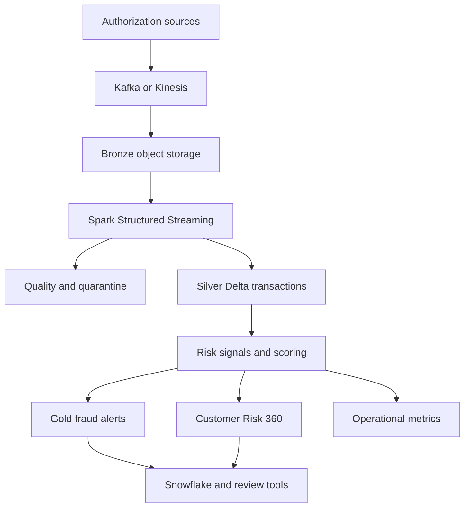

# Architecture

## System objective

The platform converts card-authorization events into trusted fraud and risk data products. It preserves raw evidence, isolates invalid data, standardizes events, removes duplicates, calculates explainable signals, and publishes alert and customer-level datasets with measurable controls.

## Logical flow

## Layer responsibilities

### Ingestion

Authorization services publish keyed events to Kafka. The card ID is the message key so related events can preserve partition ordering. Production producers use acknowledgements, retries and idempotence. Broker authentication, TLS and access-control lists restrict topic access.

### Bronze

Bronze stores the raw payload, message key, topic, partition, offset and broker timestamp. Records are append-only. This layer supports audit traceability, replay, source investigation and schema-change recovery.

### Silver

Silver parses the contract, validates identifiers and amounts, converts timestamps, checks master-data references, standardizes fields and removes duplicates by `(source_system, event_id)`. Invalid data moves to quarantine with its source location and reason. Streaming implementations use event-time watermarks and durable checkpoints.

### Risk processing

The demonstration calculates transparent signals for transaction value, merchant category, geography, device change, decision status, customer risk and short-window velocity. A production platform could add governed model inference behind the same input and output contracts.

### Gold

Gold publishes the fraud-review queue, risk-scored transactions, Customer Risk 360 and hourly operational metrics. Snowflake or another governed warehouse serves fraud, risk, compliance and analytics teams without exposing raw payloads to every consumer.

## Local and enterprise mappings

| Concern | Local implementation | Enterprise mapping |
| --- | --- | --- |
| Event source | Deterministic JSONL | Kafka or Kinesis |
| Raw retention | Bronze file copy | S3 or ADLS Delta Bronze |
| Processing | Python | Databricks Spark Structured Streaming |
| Canonical storage | CSV and SQLite | Delta Lake Silver tables |
| Consumption | CSV and SQLite | Snowflake and governed Gold tables |
| Orchestration | Makefile | Airflow |
| Governance | Documented contracts | Unity Catalog, RBAC, masking and lineage |
| Infrastructure | Local filesystem | Terraform, Docker and Kubernetes |
| Verification | unittest and JSON quality gate | CI/CD, data observability and SLA alerts |

## Reliability design

- Idempotency key: source system plus event ID.
- Replay boundary: immutable Bronze records and Kafka offsets.
- Stateful processing: checkpointed Spark queries and event-time watermarking.
- Failure isolation: rejected-record quarantine instead of silent drops.
- Publication control: reject and duplicate rates must remain under configured thresholds.
- Recovery: correct the mapping or source issue, replay the affected interval, compare control totals, then promote the output.

## Security and governance

- encrypt data in transit and at rest;
- use private network paths and managed secrets;
- apply least-privilege service roles;
- mask customer identifiers for non-investigator roles;
- separate producer, processor, investigator and analyst permissions;
- record lineage from event topic to Gold dataset;
- retain audit metadata and access logs;
- apply lifecycle and deletion policies by data classification.

